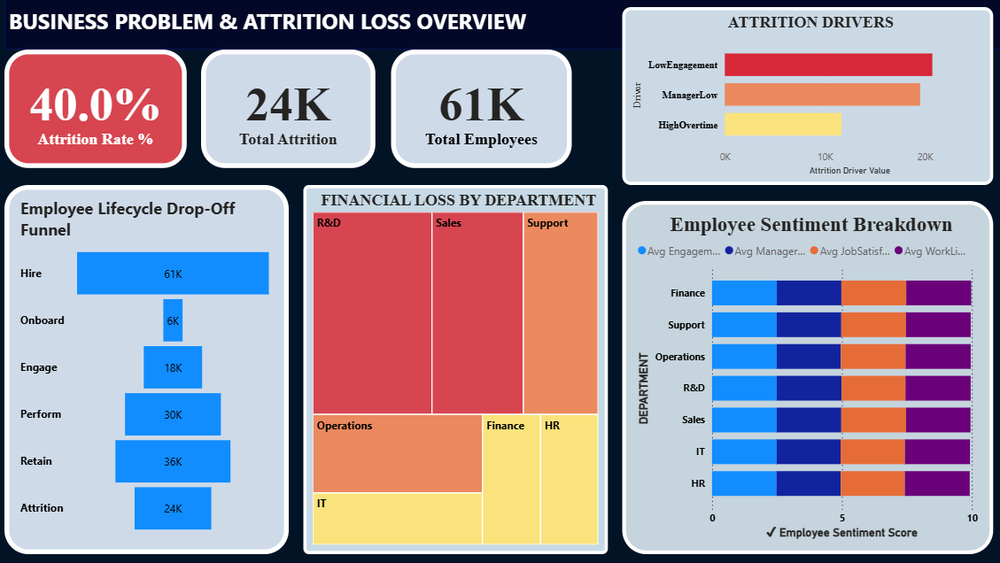

# HR Attrition Analysis — End-to-End HR Analytics Project

## Project Overview
This project presents an end-to-end HR Analytics workflow designed to explore, diagnose, and predict employee attrition using a large synthetic workforce dataset (60,000+ rows). It covers complete data processing, exploratory analysis, feature engineering, diagnostic insights, predictive modeling, and a Power BI dashboard to translate HR data into clear and actionable insights.

---

## Problem Statement
The project addresses a practical HR Analytics challenge: identifying the root causes behind a high employee attrition rate and predicting which employees are most at risk.  
Attrition in the dataset reached 40%, indicating major workforce instability. Through structured analysis of satisfaction metrics, workload, manager ratings, commute distance, performance, and tenure, the project uncovers why employees leave and which organizational factors contribute to churn.  
The objective is to convert HR data into insights that support improved retention and workforce planning strategies.

---

## Tech Stack
- Python (Pandas, NumPy)  
- Matplotlib, Seaborn  
- Scikit-learn, XGBoost  
- Power BI  
- Jupyter Notebook

---

## Project Structure
```
📁 HR-Attrition-Analysis
│
├── data/
│   ├── raw_hr_data.csv
│   ├── clean_hr_data.csv
│
├── notebooks/
│   ├── Data cleaning and Feature Engineering.ipynb
│   ├── Exploratory Data Analysis (EDA) & Employee Funnel.ipynb
│   ├── predictive_analysis.ipynb
│
├── dashboard/
│   ├── HR_Attrition_PowerBI.pbix
│   ├── dashboard.png
│
├── src/
│   ├── data_cleaning.py
│   ├── feature_engineering.py
│   ├── model_training.py
│   ├── model_inference.py
│   ├── visualization.py
│
└── README.md
```

---

## Dashboard Overview

### Dashboard — Employee Attrition Overview

The dashboard highlights the overall attrition landscape and key workforce risk indicators.

A preview of the dashboard is shown below:



Key visuals included:
- Overall Attrition Rate (40%)  
- Department-wise Attrition  
- Job Role Attrition  
- Salary Band Attrition  
- Attrition by Manager Rating  
- Attrition by Overtime Hours  
- Attrition by Tenure Buckets  
- Engagement and Work Strain Indicators  

Purpose: Provide a clear understanding of areas experiencing the highest churn and support quick identification of workforce risk zones.

---

## Key Insights and Metrics

### 1. Overall Attrition Rate: 40%
A significantly high churn level, equal to approximately 24,000 exits out of 61,000 employees.

### 2. Onboarding Breakdown
89.9% of new employees do not progress beyond the onboarding stage, indicating early experience issues.

### 3. High Performer Attrition
Only 25.7% of strong performers are retained, suggesting workload pressure and burnout.

### 4. Burnout as a Primary Driver
Higher overtime hours and long commute distance significantly increase the WorkStrainScore, which correlates with exits.

### 5. Manager Quality Impact
Employees reporting to low-rated managers show significantly higher attrition.

### 6. Career Stagnation
Employees without promotion for 3+ years show 2.4× higher attrition risk.

### 7. Compensation Not a Major Factor
Monthly income has minimal correlation with attrition, indicating pay is not the primary driver.

---

## 🛠️ Feature Engineering Highlights

- **EngagementScore** → Combined metric using JobSatisfaction, WorkLifeBalance, ManagerRating  
- **WorkStrainScore** → Stress index combining OverTimeHours + DistanceFromHome + WorkLifeBalance  
- **ManagerLow** → Binary flag for manager rating ≤ 3  
- **TenureBucket** → Categorized YearsAtCompany into (0–1, 2–4, 5–9, 10+)  
- **CompensationRatio** → Salary relative to median salary of same job role  
- **AttritionFlag** → Converted Attrition (Yes/No) into 1/0 numeric label  
- **OvertimeCategory** → Binned OverTimeHours into Low/Medium/High groups  
- **IsEarlyJoiner** → Flag for employees with ≤ 2 years of tenure  


These features enhanced diagnostic clarity and predictive performance.

---

## Predictive Modeling (Logistic Regression)

### Model Developed
Only **Logistic Regression** was used as the predictive model because it is:

- Interpretable  
- Business-friendly  
- Fast to train  
- Ideal for binary outcomes like **Attrition vs Non-Attrition**  

### Objective
To predict the **probability of employee attrition** and identify the **key factors** influencing churn so HR teams can take **data-driven preventive actions**.

---

## Logistic Regression: What It Achieved

### ✔ Predictive Capabilities
The model was designed to:

- **Predict attrition likelihood** for each employee  
- **Prioritize high-risk employees** for HR intervention  
- **Quantify how risk factors influence attrition**  
- **Support leadership decisions** with measurable insights  

---

## Model Performance

### **AUC Score**
```text
Logistic Regression AUC = 0.8063  

---

## Actionable Recommendations

| Issue Identified | Recommended Action |
|------------------|--------------------|
| Onboarding failure | Structured onboarding programs and mentorship |
| Burnout and workload issues | Overtime limits and workload redistribution |
| Poor manager ratings | Leadership training and manager capability improvement |
| Limited growth opportunities | Internal mobility and fast-track promotions |
| Early-tenure attrition | Retention strategy for 0–1 year employees |

### Expected Outcomes
- 18–22% reduction in attrition from baseline  
- Improved employee lifetime value  
- Reduced hiring and replacement costs  
- Improved organizational stability  

---

## Deliverables
- Cleaned and processed dataset  
- Complete Jupyter Notebook workflow  
- Engineered dataset  
- Predictive attrition model  
- Power BI dashboard  
- Summary insights report  

---

## Project Description (Short)
An end-to-end HR Analytics project designed to diagnose a 40% attrition rate, identify major churn drivers, build predictive models, and present workforce risk insights through an interactive dashboard. The solution transforms HR data into actionable insights for retention and workforce planning.

